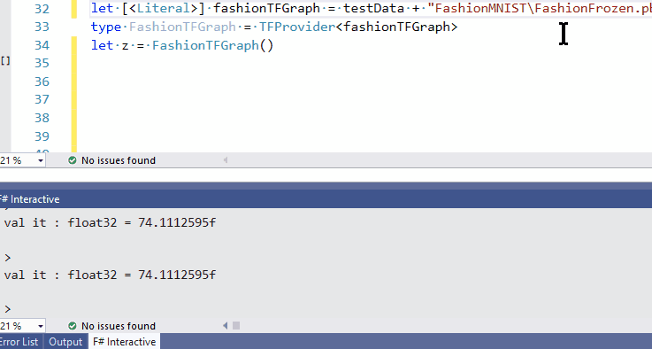
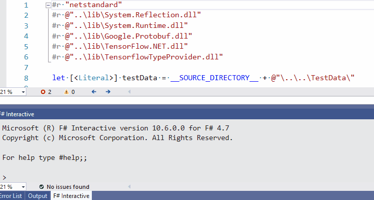
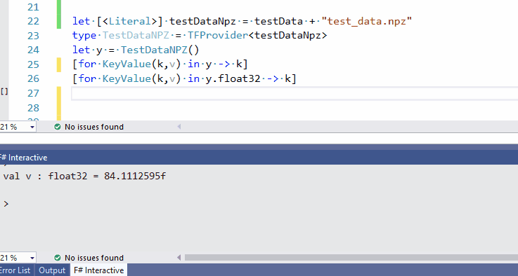

# TensorflowTypeProvider

This Type Provider replaces the need for ‘magic strings’ associated with accessing pre-trained TensorFlow Graphs. 

This demonstrates that the programming model can be separated from the execution and that design time shape information can be represented within the type system. 

This provides a more interactive and intuitive mechanism for exploring the TensorFlow Graphs than either the programmatic interrogation with Python or the nested graphical exploration with TensorBoard. 

There is also typed access to NPY/NPZ files.

# Build

`dotnet build TensorflowTypeProvider`

## TensorFlow Graph example

This example demonstrates using the Type Provider to explore a FashionMNIST Graph. Even a very small graph like this has a large number of nodes. This provider enables completion on node names as well as grouping the nodes by their Operation type. Each node has attributes which can be explored via the AttrList property. This makes it easier to examine node properties such as padding and data_format on the Conv2D nodes.

## NPY example

This shows that the rank and data type are provided from the NPY file. When we change the NPY file the type system updates to reflect this change. This ensures that the Item function always has the correct rank for indexing into the underlying array.

## NPZ example

NPY files are a zip archive of NPY files. In this example the NPY file names have a file system like hierarchy with the separator '/'. The first level directories refer to the datatype and the second level refers to the shape. The NPY file pulled from the final path has the corresponding datatype and shape.

